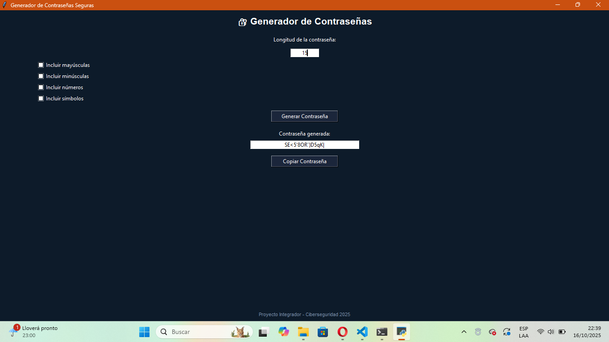

# 🔐 Generador de Contraseñas Seguras

**Proyecto Integrador – “El impacto de las nuevas tecnologías en la sociedad: visualización del futuro”**

---

## 🧩 Datos del Grupo
- **Nombre del estudiante:** Martín Gómez (Lacuysia22)  
- **Carrera:** Ingeniería en Ciberseguridad  
- **Materia:** Lógica de Programación 
- **Fecha:** Octubre 2025  
- **Repositorio:** [Proyectologic4](https://github.com/Lacuysia22/Proyectologic4)

---

## 🎯 Objetivo del Programa
Desarrollar una **herramienta práctica** que permita generar contraseñas seguras y personalizables para aumentar la protección de la información personal y profesional. Este proyecto integra conceptos de programación, seguridad informática y buenas prácticas de uso de nuevas tecnologías.

---

## 💻 Descripción General
Aplicación de escritorio en **Python 3** con **Tkinter** que permite:
- Definir la longitud de la contraseña (4–40 caracteres).  
- Incluir o excluir mayúsculas, minúsculas, números y símbolos.  
- Generar contraseñas aleatorias y copiarlas al portapapeles.  
- Validar entradas y mostrar mensajes de error/confirmación.

---

## ⚙️ Funcionalidades Principales
- Entrada de longitud con validación.  
- Checkboxes para mayúsculas, minúsculas, números y símbolos.  
- Generación aleatoria de contraseñas (`random.choice`).  
- Copia al portapapeles con mensaje de confirmación.  
- Mensajes de error si no se selecciona ninguna opción o la longitud es inválida.

---

## 🧠 Diseño Técnico
- Pseudocódigo: `docs/pseudocodigo.txt`  
- Diagrama de flujo: `diagramas/diagrama_flujo.md` (Mermaid)  
- Análisis de software: `docs/analisis.md`  

---

## 📊 Resultados y Pruebas
Archivo: `docs/pruebas.md`  
- Ejemplo: Longitud 12, pool completo → Entropía ≈ 74 bits  
- Ejemplo: Longitud 16, pool completo → Entropía ≈ 99 bits  
- Observación: Contraseñas generadas aleatoriamente, tiempo de ejecución casi instantáneo.

---

## 🛠️ Implicaciones y Limitaciones
Archivo: `docs/limitaciones.md`  
- Beneficios: Facilita crear contraseñas seguras y promueve buenas prácticas de seguridad.  
- Limitaciones: No almacena contraseñas; seguridad depende del entorno donde se use; no implementa cifrado.  
- Mejoras futuras: Uso del módulo `secrets` para mayor seguridad, integración con gestores de contraseñas.

---
  
  ## 🎥 Video Demostrativo

---

## 🧾 Conclusión
El Generador de Contraseñas combina programación, seguridad y usabilidad. Permite al usuario generar contraseñas seguras de forma sencilla y demuestra cómo la tecnología puede mejorar la seguridad personal y organizacional.
